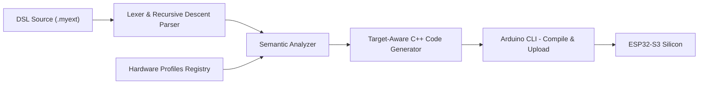

```
 ███╗   ██╗ ██████╗ ██╗   ██╗ █████╗ 
 ████╗  ██║██╔═══██╗██║   ██║██╔══██╗
 ██╔██╗ ██║██║   ██║██║   ██║███████║
 ██║╚██╗██║██║   ██║╚██╗ ██╔╝██╔══██║
 ██║ ╚████║╚██████╔╝ ╚████╔╝ ██║  ██║
 ╚═╝  ╚═══╝ ╚═════╝   ╚═══╝  ╚═╝  ╚═╝

N O V A  |  Embedded Control Language and Transpiler
```

[](LICENSE)
[](https://www.python.org/)
[](CONTRIBUTING.md)

> "What I cannot create, I do not understand."
> - Richard Feynman

---

## Introduction

NOVA is a domain-specific compiler for embedded control systems. It accepts a purpose-built hardware automation language (`.myext`), performs multi-pass semantic analysis against formalized silicon profiles, and emits board-accurate Arduino C++ suitable for direct compilation and flashing via `arduino-cli`. The system is designed for deterministic firmware workflows where correctness is a function of both language-level typing and silicon-level constraint satisfaction.

Unlike general-purpose transpilers that treat hardware as an afterthought, NOVA encodes board topology - GPIO validity ranges, reserved peripheral regions, PSRAM interference zones - into the semantic analysis phase itself. A program that would produce silent misbehavior at runtime is rejected at compile time with precise source coordinates.

NOVA's correctness guarantees rest on three structural invariants:

1. **Syntactic rigor** - An explicit EBNF grammar drives a hand-written recursive descent parser, producing a fully typed AST with source-position annotations at every node.
2. **Semantic safety** - Board-aware hardware profiles are loaded during semantic analysis. Every pin reference, peripheral assignment, and timing assumption is validated against the selected silicon profile before code generation begins.
3. **Backend fidelity** - The code generation pass performs target-aware lowering. DSL-level primitives (e.g., `rgbWrite`) are resolved to board-native intrinsics (e.g., `neopixelWrite`) with no external library dependencies and no behavioral approximation.

## NOVA 2.0 Highlights

NOVA 2.0 expands the language from a single-file control DSL into a modular embedded systems language with richer type and concurrency primitives.

- **Structs and member access**: declare POD-style structs, initialize with named fields, and access members via `.`.
- **Pattern control flow**: use `match` with wildcard exhaustiveness checks and value-producing `if` expressions.
- **Task orchestration**: declare `task` units, annotate them with `@core(...)` and `@rate(...)`, and launch with `spawn`.
- **Declarative buses/devices**: describe `bus` and `device` resources directly in DSL and lower to board APIs (`Wire.begin(...)` for I2C).
- **Module imports**: split programs across files with `import` and compile via topological module graph merge.
- **Explicit casting and unsafe regions**: use `as` for primitive casts and `unsafe { ... }` for controlled raw backend escape hatches.

## Phase 2: The Web Layer

Phase 2 introduces native networking modules that run directly on ESP32-class hardware:

- **`wifi.myext` standard module**: typed Wi-Fi configuration via `WiFiConfig` and a blocking `connectWiFi(...)` flow.
- **`http.myext` standard module**: native HTTP serving with route wiring and FreeRTOS-friendly client handling.
- **Race-safe server startup**: web task startup waits for `WL_CONNECTED` before `WebServer::begin()`.
- **Heap-backed server allocation**: `WebServer` is allocated off the task stack to reduce crash/reboot risk.
- **Dynamic include emission**: codegen scans AST/unsafe payloads and injects only required global headers (`WiFi.h`, `WebServer.h`, `Wire.h`).

## Phase 3: Security and Hardware Cryptography

Phase 3 introduces native cryptographic primitives for ESP32-class targets through the ESP-IDF `mbedtls` integration layer.

- **`crypto.myext` standard module**: exposes `hashSha256(payload: string)` for SHA-256 digest generation.
- **ESP32-S3 hardware-backed path**: digest operations run through `mbedtls` APIs that can leverage on-chip crypto accelerators when available.
- **Safe prelude include strategy**: codegen injects `#include <mbedtls/md.h>` globally when crypto usage is detected, keeping unsafe payloads free of preprocessor directives.
- **V1 output model**: SHA-256 digest is emitted as lowercase hexadecimal text through `Serial.println(...)`.

## Developer Experience

- **Live CLI monitor**: `python cli.py monitor --port COM6 --baud 115200`
- **Official VS Code Extension**: syntax + language configuration are shipped in `nova-vscode/` for workspace/editor integration.

---

## Live Transpilation Simulation

The following session demonstrates NOVA's constraint enforcement behavior in practice. The compiler first rejects a program that references a GPIO line outside the valid range of the selected board profile. After the correct board identifier is supplied, semantic analysis passes and the pipeline proceeds through code generation and upload.

```powershell
# Attempt 1: incorrect board profile supplied - GPIO48 is absent on classic esp32
PS C:\Users\noami\Desktop\code1\NOVA> python cli.py check blink.myext --target esp32 --board esp32

[nova:info]  Loading hardware profile  : esp32
[nova:info]  Source                    : blink.myext
[nova:info]  Pass 1/3 - Lexical analysis        ... OK
[nova:info]  Pass 2/3 - AST construction        ... OK
[nova:info]  Pass 3/3 - Semantic & board check  ... FAILED

[semantic:error] blink.myext:1:20  GPIO48 is not a valid GPIO pin on board 'esp32'
                                   Valid range: GPIO0-GPIO33 (excluding strapping pins 0, 2, 12, 15)
                                   Hint: Did you mean --board esp32s3_n16r8?

Compilation terminated. 1 error, 0 warnings.

# Attempt 2: correct S3 profile with 16 MB Flash / 8 MB PSRAM variant
PS C:\Users\noami\Desktop\code1\NOVA> python cli.py transpile blink.myext --target esp32 --board esp32s3_n16r8 --out build/blink_s3.cpp

[nova:info]  Loading hardware profile  : esp32s3_n16r8
[nova:info]  Source                    : blink.myext
[nova:info]  Pass 1/3 - Lexical analysis        ... OK (47 tokens)
[nova:info]  Pass 2/3 - AST construction        ... OK (depth=6, nodes=21)
[nova:info]  Pass 3/3 - Semantic & board check  ... OK
[nova:info]  Lowering rgbWrite -> neopixelWrite  (ESP32 Core v3 native)
[nova:info]  Code generation target    : esp32
[nova:info]  Output                    : build\blink_s3.cpp

Generated C++: build\blink_s3.cpp  (target=esp32, board=esp32s3_n16r8)
0 errors, 0 warnings.

# Verify addressable-LED lowering in emitted output
PS C:\Users\noami\Desktop\code1\NOVA> Select-String -Path build\blink_s3.cpp -Pattern "neopixelWrite"

build\blink_s3.cpp:34:  neopixelWrite(PIXEL_PIN, 32, 0, 0);
build\blink_s3.cpp:37:  neopixelWrite(PIXEL_PIN, 0, 0, 0);

# Full pipeline: compile, link, and flash to target over serial
PS C:\Users\noami\Desktop\code1\NOVA> python cli.py build blink.myext --target esp32 --board esp32s3_n16r8 --fqbn esp32:esp32:esp32s3 --upload --port COM6

[nova:info]   Invoking arduino-cli  (fqbn=esp32:esp32:esp32s3, port=COM6)
[arduino-cli:info]  Compiling sketch...
[arduino-cli:info]  Sketch uses 267,432 bytes (20%) of program storage space.
[arduino-cli:info]  Global variables use 21,304 bytes (6%) of dynamic memory.
[arduino-cli:info]  Uploading...
[arduino-cli:info]  Upload successful.

Build complete. Firmware resident on device.
```

---

## The Physics of Silicon Abstraction

Microcontroller firmware operates at the intersection of software correctness and physical electrical reality. GPIO lines are not abstract integers - they are multiplexed pads with fixed alternate functions, pull configurations, drive strength limits, and interdependencies with boot strapping logic. Memory-mapped peripherals share address space with DMA controllers. PSRAM on ESP32-S3 variants occupies specific GPIO lines during initialization, rendering those pads unavailable for general-purpose use regardless of software-level permission.

A language or toolchain that ignores these physical constraints does not simplify the problem - it defers it. Errors that could be caught statically during symbol resolution instead surface as timing violations, bus contention faults, or non-deterministic boot failures at integration time. The diagnostic distance between root cause and observable symptom is maximized precisely at the moment when a development team can least afford it.

NOVA's hardware profile system formalizes silicon constraints as structured data loaded during the semantic analysis pass. When a developer specifies `--board esp32s3_n16r8`, the compiler loads the corresponding profile - including valid GPIO ranges, reserved strapping pins, PSRAM-contention exclusions, and peripheral mapping constraints - and evaluates every DSL statement against that profile before a single line of C++ is emitted.

The `rgbWrite(pin, r, g, b)` primitive exemplifies the same principle applied to protocol timing. WS2812B and compatible addressable LED drivers are not memory-mapped peripherals - they operate on precise single-wire NRZ waveforms where pulse widths are measured in hundreds of nanoseconds. An incorrect software delay loop or an abstraction layer that routes through a general I/O path can produce spurious color frames or total signal failure. NOVA resolves `rgbWrite` directly to `neopixelWrite`, the timing-safe intrinsic provided by the ESP32 Arduino Core v3, ensuring that waveform generation is delegated to a path that has been validated against the specific RMT peripheral configuration of the target SoC. The DSL remains concise. The silicon contract is honored.

---

## Compiler Architecture



### Core Pipeline Modules

| Module | Responsibility | Engineering Outcome |
|---|---|---|
| `lexer.py` | Deterministic tokenization with full source-coordinate tracking | Precise diagnostic attribution; no ambiguous token boundaries |
| `parser.py` | Hand-written recursive descent parser producing a typed AST | Structural correctness enforced at parse time; recoverable error paths |
| `ast_nodes.py` | Typed node hierarchy with position metadata at every node | Uniform diagnostic emission surface across all compiler passes |
| `semantic.py` | Symbol resolution, type checking, and board-profile constraint validation | Pre-emission rejection of all invalid hardware and program states |
| `codegen.py` | Multi-target lowering to Arduino C++ with native intrinsic resolution | Correct target semantics; zero external dependencies for LED control |

### Supporting Infrastructure

| Module | Responsibility |
|---|---|
| `module_graph.py` | Dependency resolution and topological ordering for multi-file import graphs |
| `cli.py` | Orchestration layer for `check`, `transpile`, `build`, and live `monitor` workflows |
| `api.py` | FastAPI backend exposing remote transpilation over HTTP |
| `nova-vscode/` | Official VS Code extension package (grammar + language configuration) |
| `DSL_GRAMMAR.ebnf` | Normative grammar specification; ground truth for parser implementation |
| `LANGUAGE_DOCS.md` | Language reference and semantic contract documentation |

---

## Toolchain Usage

### Environment Setup

```powershell
# Create and activate an isolated Python environment
python -m venv .venv
.\.venv\Scripts\Activate.ps1
pip install -r requirements.txt
```

```powershell
# Install ESP32 Arduino core support via arduino-cli
arduino-cli core update-index
arduino-cli core install esp32:esp32
```

### Canonical Workflow

**Stage 1 - Static analysis and hardware profile validation:**

```powershell
python cli.py check blink.myext --target esp32 --board esp32s3_n16r8
```

Runs all compiler passes through semantic analysis. Exits zero on success. No output is produced.

**Stage 2 - Transpilation to target C++:**

```powershell
python cli.py transpile blink.myext --target esp32 --board esp32s3_n16r8 --out build/blink.cpp
```

Performs full compilation and writes the emitted C++ to the specified output path. All primitive lowering (including `rgbWrite` -> `neopixelWrite`) is applied at this stage.

**Stage 3 - Compile, link, and flash:**

```powershell
python cli.py build blink.myext --target esp32 --board esp32s3_n16r8 --fqbn esp32:esp32:esp32s3 --upload --port COM6
```

Invokes `arduino-cli` for final compilation and upload. Requires a connected device on the specified port.

**Stage 4 - Runtime serial diagnostics (live monitor):**

```powershell
python cli.py monitor --port COM6 --baud 115200
```

Streams runtime firmware logs directly from the device over serial.

### Command Reference

```powershell
python cli.py check     <input.myext>  [--target esp32|generic]  [--board <profile>]
python cli.py transpile <input.myext>  [--target esp32|generic]  [--board <profile>]  [--out <path>]
python cli.py build     <input.myext>  [--target esp32|generic]  [--board <profile>]  --fqbn <fqbn>  [--upload --port <port>]
python cli.py monitor   --port <serial-port> [--baud <baudrate>]
```

Available board profiles: `esp32`, `esp32s3_n16r8`. Additional profiles follow the naming convention `<soc>_<flash>r<psram>`.

---

## Disclaimer

NOVA reduces the class of detectable hardware constraint violations to those expressible within the formalism of its hardware profile system. It does not - and cannot - eliminate all categories of board-level risk. Peripheral contention arising from runtime multiplexing decisions, power-rail integrity under load, bootstrapping-pin side effects during firmware initialization, and signal integrity degradation on high-frequency lines remain the responsibility of the integrating engineer.

Generated firmware must be validated on the exact hardware revision, PCB layout, power supply architecture, and ambient electrical environment that will be used in deployment. Statistical assurance from simulation or emulation is not a substitute for physical characterization.
